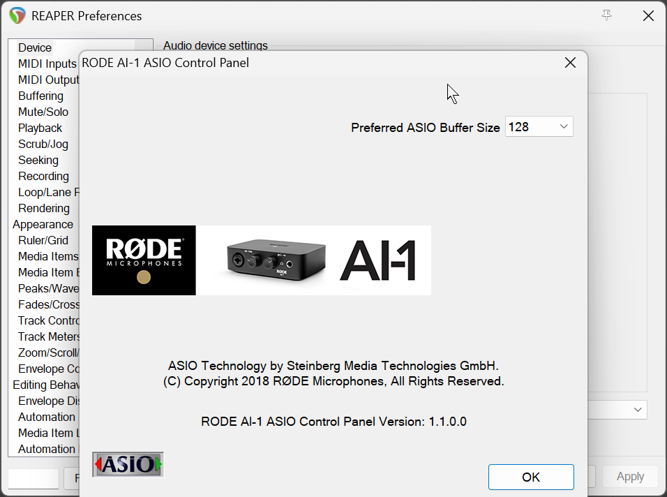
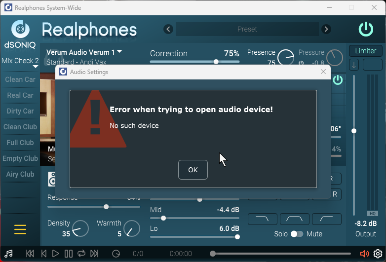
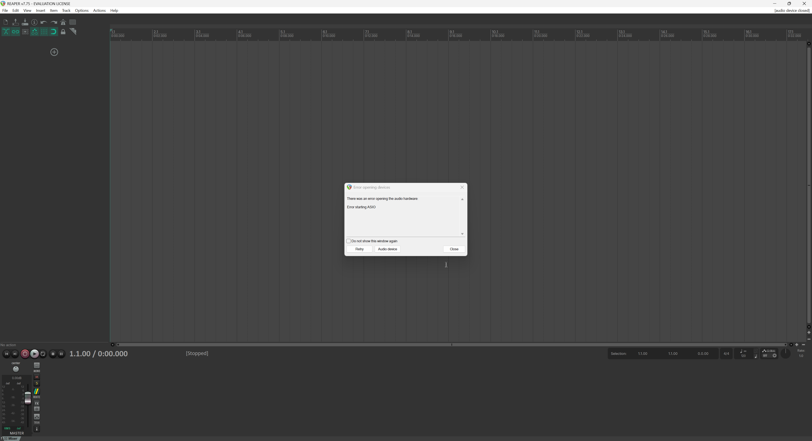
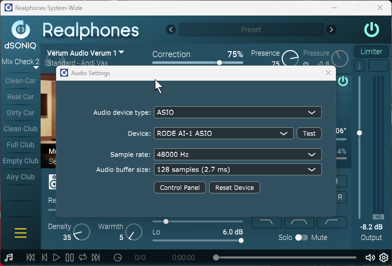

# RØDE AI-1 ASIO Driver Fix (Windows)

Fix for the official **RØDE AI-1** ASIO driver that **lists in your DAW but refuses to open** with:

- `No such device`
- `Error starting ASIO` / `Cannot initialize ASIO driver`

…even though the AI-1 shows up perfectly fine in Windows and works for normal playback.

> 🔗 **This repairs the _official_ RØDE AI-1 ASIO driver** — the one from RØDE's own product page: **[rode.com/en-int/products/ai-1 → Downloads](https://rode.com/en-int/products/ai-1#section-downloads)**. It is **not** a third-party replacement (like ASIO4ALL/FlexASIO); it fixes the registry path that the official installer leaves broken.

> **Affects every ASIO host at once** — REAPER, OBS, Ableton Live, Cubase, FL Studio, Realphones, etc. — because they all read the same broken registry entry.

> ✅ **Status: confirmed working as of 2026-06-27** — verified on Windows 11 24H2 (build 26200) with RODE AI-1 ASIO **1.1.0.0**, the current driver at the time of writing.



---

## TL;DR

The official AI-1 ASIO installer puts its DLLs in a folder whose name contains the special letter **`Ø`**:

```
C:\Program Files (x86)\RØDE Microphones\AI-1-ASIO\
```

But on Windows systems whose **"Language for non-Unicode programs" (system locale)** can't represent `Ø`, the installer writes the **wrong path** into the registry — with a plain ASCII **`O`**:

```
C:\Program Files (x86)\RODE Microphones\AI-1-ASIO\   ←  registry (WRONG — this folder doesn't exist)
```

`Ø` (U+00D8) and `O` are **different characters**, so the path the registry hands to COM/your DAW points to a file that isn't there. The driver loads from the registry list, then fails the moment a host tries to instantiate it.

Two fixes are provided:

1. **[Fix the registry path](#fix-1--repair-the-registry-one-time)** — one-time repair.
2. **[Create a permanent junction](#fix-2--permanent-immunity-junction)** — survives future driver reinstalls.

👉 **Not comfortable with the registry or command line? Jump to [Quick Start](#quick-start-no-experience-needed) for click-by-click steps.**

---

## Symptoms checklist

- ✅ Device Manager shows **RODE AI-1** with status **OK** (it uses the generic Microsoft USB-Audio class driver — that's normal for the AI-1).
- ✅ Windows playback / Sound settings see the AI-1 fine.
- ✅ `RODE AI-1 ASIO` **appears** in your DAW's ASIO device list.
- ❌ Selecting it → **`No such device`** or **`Error starting ASIO`**.
- ❌ The failure is identical in **all** ASIO applications.

What it looks like — the driver is in the list, but opening it fails:

| `No such device` (Realphones) | `Error starting ASIO` (REAPER) |
|:---:|:---:|
|  |  |

If that matches you, this is almost certainly the path-mismatch bug.

---

## Quick Start (no experience needed)

Just want it working and don't care about the details? Follow these steps — about 3 minutes, **no prior command-line experience required**.

> **Prerequisite:** the **official RØDE AI-1 ASIO driver** must already be installed. Get it from RØDE's official page → **[rode.com/en-int/products/ai-1 → Downloads](https://rode.com/en-int/products/ai-1#section-downloads)**. This repo *fixes* that driver — it doesn't replace it.

### 1. Download the files

1. Click the green **`< > Code`** button near the top of this page → **Download ZIP**.
2. Open your **Downloads** folder, right-click `rode-ai-1-asio-fix-main.zip` → **Extract All… → Extract**.
3. Open the extracted folder, then open the **`scripts`** folder inside it.

### 2. Run the fix

1. Inside the `scripts` folder, hold **Shift** and **right-click** an empty spot → choose **"Open PowerShell window here"** (on some systems it's **"Open in Terminal"**).
   *If you don't see that option: click the folder's address bar, type `powershell`, and press **Enter**.*
2. Copy-paste this line and press **Enter**:
   ```powershell
   powershell -ExecutionPolicy Bypass -File .\fix-registry.ps1
   ```
3. A blue **User Account Control** window appears asking for permission — click **Yes**. (The fix needs admin rights to edit the registry; it **backs everything up first**.)
4. A window shows what changed and ends with **"Done."** Press **Enter** to close it.

> 💡 You don't have to find any files or paths yourself — the script locates the driver and corrects the registry automatically.

### 3. Check that it worked

1. **Fully close** your app (REAPER, OBS, Cubase, Ableton, Realphones…) and open it again.
2. In its audio settings, choose **ASIO → RODE AI-1 ASIO**.
3. It should now open **without** the `No such device` / `Error starting ASIO` message. 🎉



### 4. (Recommended) Make it survive future reinstalls

So you never have to do this again — even after reinstalling RØDE software — run this once, the same way (Shift+right-click → Open PowerShell here → paste → **Yes** on UAC):

```powershell
powershell -ExecutionPolicy Bypass -File .\make-junction.ps1
```

---

**Still getting `Error starting ASIO`?** That's not the driver — another program already grabbed the AI-1. See [After it loads](#after-it-loads-error-starting-asio).

**Don't want to run scripts at all?** Do the exact same fix by hand — see [Manual alternative (regedit)](#manual-alternative-regedit).

---

## Why it happens (root cause)

An ASIO driver is a COM in-process server. Windows finds the DLL through:

```
HKLM\SOFTWARE\ASIO\RODE AI-1 ASIO Driver  →  CLSID  →
HKLM\SOFTWARE\Classes\CLSID\<CLSID>\InProcServer32          (64-bit host)
HKLM\SOFTWARE\Classes\WOW6432Node\CLSID\<CLSID>\InProcServer32   (32-bit host)
```

On an affected machine those `InProcServer32` default values read:

```
c:\program files (x86)\rode microphones\ai-1-asio\rode-ai-1-asio-x64.dll
c:\program files (x86)\rode microphones\ai-1-asio\rode-ai-1-asio.dll
```

…while the files actually live under `RØDE Microphones`. Character codes make the mismatch obvious:

| Path source | Letters | Code points |
|---|---|---|
| Registry (wrong) | `R O D E` | `82, 111, 68, 69` |
| Real folder | `R Ø D E` | `82, 216, 68, 69` |

`111 = o` vs `216 = Ø`. The DLL is present, the pointer is wrong.

This is a classic installer bug: the folder is created with the proper Unicode name, but the registry value is written through an **ANSI** code path under a non-matching system code page, which transliterates `Ø → o`.

---

## Diagnose first (read-only)

Run [`scripts/diagnose.ps1`](scripts/diagnose.ps1) in PowerShell (no admin needed). It prints each `InProcServer32` path and whether it resolves:

```powershell
powershell -ExecutionPolicy Bypass -File .\scripts\diagnose.ps1
```

A red `exists: False` confirms the bug.

---

## Fix 1 — Repair the registry (one-time)

[`scripts/fix-registry.ps1`](scripts/fix-registry.ps1) self-elevates (UAC), **backs up** the affected keys to `%TEMP%`, locates the real DLLs, and rewrites both `InProcServer32` values to the correct path. It only touches the `(default)` value and preserves `ThreadingModel`.

```powershell
powershell -ExecutionPolicy Bypass -File .\scripts\fix-registry.ps1
```

Then **fully restart your DAW** and select `RODE AI-1 ASIO` again. No reboot needed — COM re-reads the path on each launch.

### Manual alternative (regedit)

Prefer not to run a script? Do the exact same change by hand:

1. Press **`Win + R`**, type **`regedit`**, press **Enter**, click **Yes** on the prompt.
2. Paste this into Registry Editor's **address bar** (top) and press **Enter**:
   `Computer\HKEY_LOCAL_MACHINE\SOFTWARE\ASIO\RODE AI-1 ASIO Driver`
   On the right, double-click **`CLSID`** and **copy** its value (it looks like `{46AD04E9-…}`).
3. Get the correct path **with the real `Ø`**: open `C:\Program Files (x86)` in File Explorer, open the **`RØDE Microphones\AI-1-ASIO`** folder, click the **address bar**, and copy the full path shown there.
4. Go to each key below (paste in regedit's address bar, replacing `<CLSID>` with the value from step 2), double-click **`(Default)`**, and set it to the real file:
   - `Computer\HKEY_LOCAL_MACHINE\SOFTWARE\Classes\CLSID\<CLSID>\InProcServer32`
     → `…\RØDE Microphones\AI-1-ASIO\RODE-AI-1-ASIO-x64.dll`
   - `Computer\HKEY_LOCAL_MACHINE\SOFTWARE\Classes\WOW6432Node\CLSID\<CLSID>\InProcServer32`
     → `…\RØDE Microphones\AI-1-ASIO\RODE-AI-1-ASIO.dll`
5. Close Registry Editor and restart your DAW.

> ⚠️ The whole bug **is** that `Ø`. Don't retype the path by hand — you'll almost certainly type a normal `O` and reproduce the problem. Copy it from Explorer's address bar so the character is exact.

---

## Fix 2 — Permanent immunity (junction)

If you ever **reinstall** the driver, the installer can rewrite the broken ASCII path again. To make that harmless, create a directory junction so the ASCII path *also* resolves:

```
C:\Program Files (x86)\RODE Microphones  →  C:\Program Files (x86)\RØDE Microphones
```

Run [`scripts/make-junction.ps1`](scripts/make-junction.ps1) (self-elevates):

```powershell
powershell -ExecutionPolicy Bypass -File .\scripts\make-junction.ps1
```

Now both spellings point to the same files — reinstall-proof. Combine with Fix 1 for belt-and-suspenders.

---

## After it loads: `Error starting ASIO`

The path is fixed and the driver **loads**, but a host still says **`Error starting ASIO`**? The driver is fine — the device just can't be *opened*. Common causes, in order:

1. **Another ASIO app already holds it.** The AI-1 ASIO driver is **single-client** — only one ASIO host at a time. Close the others (Realphones, another DAW…), then *Retry*. Apps on normal Windows audio (OBS capture, Discord) can use it **at the same time** via **WASAPI** — only a *second ASIO host* conflicts.
2. **Exclusive mode is off.** Windows → *Sound* → AI-1 → **Properties → Advanced** → tick **both** "Allow applications to take exclusive control…" boxes — for **both** the Playback **and** the Recording device. ASIO needs exclusive access.
3. **Your DAW requests the wrong input channel count.** The AI-1 has a **single (mono) input**. If the DAW tries to open 2 input channels, the start fails. Set the input to **one** channel — or disable inputs if you only play back.
4. **Something else is holding the device** — e.g. *Listen to this device* enabled on the input, or another app streaming to the AI-1 while it's the default device.

### REAPER note (keep this in mind if the error reappears)

In *Preferences → Audio → Device*:
- Set **Enable inputs → first and last both to channel 1** (mono) — the AI-1 has one input; asking for 2 is the usual cause of `Error starting ASIO` in REAPER. Or just **uncheck Enable inputs** if you only need output.
- Stubborn driver? Tick **Ignore ASIO reset messages**, then *Retry*.
- `Record Warning: No tracks are armed for recording` is **not** this error — it's just REAPER reminding you to record-arm a track before recording.

---

## Tested on

- Windows 11 Pro, build 26200 (24H2)
- RODE AI-1 ASIO Control Panel **1.1.0.0**
- Verified in REAPER 7.x, OBS 32.x, dSONIQ Realphones
- **Last verified working: 2026-06-27**

---

## Official driver & resources

- **Official RØDE AI-1 driver download** → https://rode.com/en-int/products/ai-1#section-downloads
- RØDE Help Center — *AI-1 ASIO Drivers* → https://help.rode.com/hc/en-us/articles/360000399616-AI-1-ASIO-Drivers

Always install the **official** driver from the links above first. This repository does **not** distribute the driver — it only repairs the registry entry the official installer leaves pointing at the wrong path.

## Disclaimer

These scripts edit `HKLM` registry keys and create a junction under `Program Files (x86)`. `fix-registry.ps1` backs up the affected keys to `%TEMP%` before changing anything. Use at your own risk. Not affiliated with or endorsed by RØDE.

## License

MIT — see [LICENSE](LICENSE).
